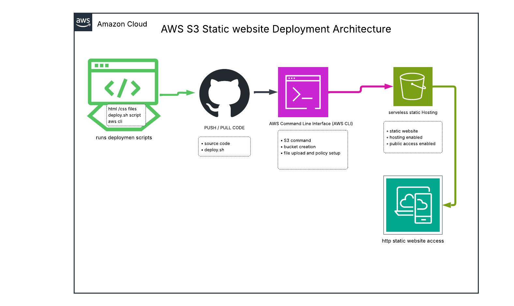

# 🚀 AWS S3 Static Website Deployment (DevOps Project)

## 📌 Overview

This project demonstrates the automated deployment of a static website using **Amazon S3** and the **AWS CLI**. It showcases core DevOps practices such as infrastructure automation, cloud resource configuration, and script-based deployment.

The solution leverages a serverless architecture, eliminating the need for traditional backend servers while ensuring high availability and low cost.

---

## 🏗️ Architecture

This project follows a simple serverless deployment model:

* Local development environment with deployment script
* AWS CLI used for automation
* Amazon S3 used for static website hosting
* Public access enabled via bucket policy
* End users access the website via HTTP endpoint

---

## 📊 Architecture Diagram



---

## ⚙️ Technologies Used

* **AWS S3** – Static website hosting
* **AWS CLI** – Resource provisioning and automation
* **Bash** – Deployment scripting
* **HTML / CSS** – Frontend content
* **Git & GitHub** – Version control

---

## 🚀 Features

* Automated S3 bucket creation
* Static website hosting configuration
* File upload automation
* Public access configuration via bucket policy
* Idempotent deployment handling (safe re-runs)
* End-to-end deployment via single script

---

## 📂 Project Structure

```
.
├── index.html
├── error.html
├── style.css
├── deploy.sh
├── bucket-policy.json
├── docs/
│   └── aws-s3-static-website-architecture.png
└── README.md
```

---

## 🔄 Deployment Process

The deployment script performs the following steps:

1. Creates an S3 bucket (if not already existing)
2. Enables static website hosting
3. Uploads website files to the bucket
4. Disables block public access settings
5. Applies bucket policy for public read access
6. Outputs the website endpoint

---

## ▶️ How to Run

### Prerequisites

* AWS CLI installed and configured
* AWS account with appropriate permissions

### Run deployment

```bash
chmod +x deploy.sh
./deploy.sh
```

---

## 🌐 Live Website

```
http://safiaddow-bucket2026.s3-website.eu-west-2.amazonaws.com
```

---

## 🔐 Security Configuration

* Public read access configured via bucket policy
* Block Public Access disabled for static hosting
* No sensitive data stored in bucket

---

## 🧠 DevOps Concepts Demonstrated

* Infrastructure automation using Bash scripting
* Cloud storage provisioning (AWS S3)
* Static website hosting architecture
* IAM policy configuration
* Idempotent deployment practices
* Version-controlled infrastructure

---

## 📈 Future Improvements

* Add **CloudFront CDN** for HTTPS and caching
* Implement **Terraform** for Infrastructure as Code
* Add **GitHub Actions CI/CD pipeline**
* Configure **custom domain with Route 53**

---

## ❗ Challenges & Solutions

**Issue:** Bucket already existed
**Solution:** Made deployment script idempotent

**Issue:** Line ending errors (`^M`) in WSL
**Solution:** Converted files using `dos2unix`

**Issue:** Git conflicts during rebase
**Solution:** Manually resolved conflicts and continued rebase

---

## 👨‍💻 Author

Safia Addow
DevOps Engineer

---
